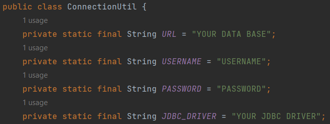
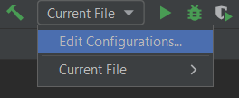
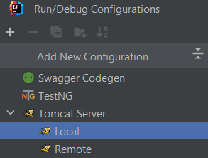
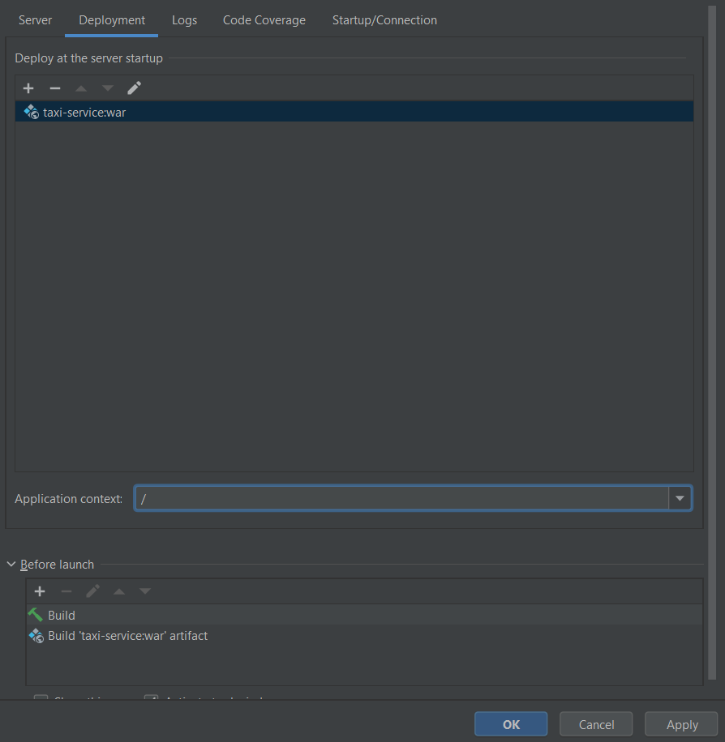

#  Taxi-Service 
This is web application to show simple CRUD operations, authentication, and registration using MySQL and servlets, without any frameworks.

Functionality
1) register a driver
2) log in and log out
3) create/read/update/delete a driver
4) create/read/update/delete a car
5) create/read/update/delete a manufacturer
6) show all drivers
7) show all cars
8) show all manufacturers

Project structure
- DAO (Data Access Object) - receives requests from the service, transfers them to the database, and executes all SQL queries.

- Service  receives requests from the controller, transmits them to the DAO level, and executes all business logic.

- Controller receives requests from the user, transmits them to the service layer, and returns jsp pages in response.
Technologies used:
Java 11
Tomcat 9.0.75
MySQL 8.0.22
Maven 3.1.1
Java Servlet 4.0.1
JSTL 1.2
JSP and CSS
JDBC

Instructions for launching the project
1) Clone this project from GitHub
2) Install Apache Tomcat version 9.x.x. You can download it from the official Apache Tomcat website: https://tomcat.apache.org/download-90.cgi. Choose the appropriate installation package for your operating system.
3) Create a database using either a local MySQL installation or a remote database. Execute the schema provided in the init_db.sql file to set up the necessary tables and structure for the project.
4) Open the project in your preferred Integrated Development Environment. Locate the ConnectionUtil class in the project. It should contain the database connection settings. Fill in the appropriate values for the following fields:
5) url: The URL of your MySQL database. It should include the host, port, database name, and any additional parameters required for connection.
6) username: The username for accessing your MySQL database.
7) password: The password associated with the provided username.

JDBC driver

Note: Make sure the database credentials you provide in ConnectionUtil match the ones you set up in step 3.

8) Set up the configuration for tomcat

9) After these steps, you need to fix tomcat. You need to select the artifact to deploy 'taxi-service:war' and remove the Application context 'taxi_service_war' to leave only '/'

10) After starting Tomcat, you will be able to access your application by the URL# taxi-service
